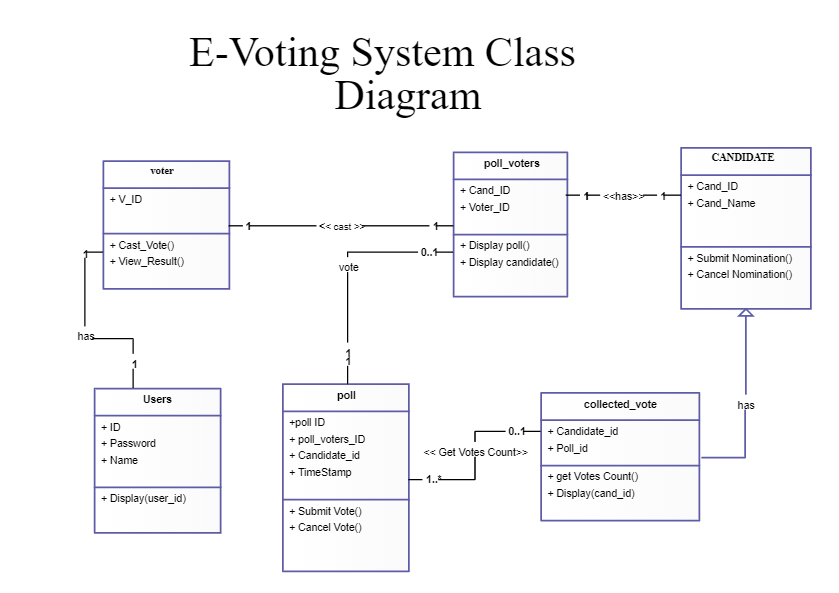

# Architecture:
## UML Diagrams:
### BEHAVIOUR DIAGRAM:
#### Use case UML diagram:

#### Sequence Diagram:

#### Flow chat:

### STRUCTURAL DIAGRAM:
#### Activity Diagram:

#### Activity Diagram:

## Tools:
- Draw.io
  