# StepIn-VotingSystem

### Indrocution
A command line based voting system that can be used for various purpose and at various Educational Institutes 

    Voting System Application  helps in casting and calculating the votes. This application has 2 different section.
    
        1. Student Section (Panel)
        2. Admin Section (Panel)
        3. Exit( system Exit)
   
    Evolving from pen paper based election to Digital casting of election has made it easy to keep the track on the number of votes, counting and recognising the duplicate votes or illegal votes.
    The Voting system can be used for varoius purpose.
    Here the system designed is only for Eductional institude election level.

### Research:
- Manual Pen Paper voting is time consuming process
- Manual counting usally takes alot of time and resourses
- Understanding the difficultly of illegal votes is tough.
- Electronic based voting helps in saving the resoures and is eco friendly
- Electronic based voting is fast and easy.

### Defining of the Application:
- The Proposed system ensures the complete freedom to users,  this allows to tract the illegal votes and get detailed information about  each candidates and there votes. 
-  This system ensures that only registered students are allowed to vote.
    
### objective:
  The main objective of this Project is:
  1. To Allow the user to cast there own vote.
  2. To Create Election and execute the election.
  3. To Allow the application to decide the winner.  

### Future Work:
1. The system must keep track of Banned candidates.
2. The system must keep track of Banned students(voters).
3. The system must check illegal Votes and must allow the admin to remove them.
4. The System must Check for voted voter and must not allow them to vote again.
5. The system must be flexible for all the departments

### Folder Structure:
|Folder Name|Folder Defination|
|---------------------------------|-----------------------------------------------------------------------------------------------------------|
| 1_Requirements | Includes Intrdocution, Research, Defining the Application, Objective, SWAT Analysis, Functional and Non-Functional Requireents and Future Work|
| 2_Architecture | Includes Behaviour and Strucural Diagrams |
| 3_Implementation | Includes Source code, Header files, make file, unit test files |
| 4_TestPlanAndOutput | Includes the High level and low level test plan with corresponding outputs |
| 5_Report | Includes Documentation |
| 6_ImagesAndvideos | Includes Output image and small video |
| 7_other | Includes Future Work and Future Test |

### Contributors:
| Name | Feature | Status |
|---------------|--------------------------------|-----------|
| SHUBHAM AGARWAL | An Application to conduct Voting in Educational Institutes | Implemeted|

## Reqirements:

### SWAT Analysis:
#### Strenght:
- User can cast vote to desired canidate.
- Application is a multi-platfrom application.
  
#### Weakness:
- No Encryption
- Limited to serial registered students
- Limited to Branch Eductaional Institute.

#### Oppurtinities:
- UI can be made better by using mark-up languages.
- Addtional functions such as candidate profile can be added.
- Addtional functions such as Check banned students, check duplicate votes, remove votes when system fails can be added.
  
### 4W's and 1 H:
    
    1. WHO:
        Anyone one who wants to conduct election can use this Application.
    
    2. WHAT:
        This Application uses file read write and count method to store and process elections.
    
    3. WHEN:
        This project can be used by Educational Institutes for choosing best from the list of candidates.
    
    4. WHY:
        As this project is better than pen paper election, plus results are computrized.
    
    5. HOW:
        Implemented using Structure and file read write functions of C programs.
        To run this particular application one must have:
            1. GCC compiler.
            2. Any operating system (preffered Windows or Linux).

### Functional Requirements:
#### High Level Requirements:
1. The System must allow the Admin to login.
2. The system must allow the Admin to create new election.
3. The System must allow the Admin to add candidates to Election.
4. The system must allow the Admin to check Election results.
5. The system must allow the voters(student) to cast there vote based on the Registered student ID.
6. The system must allow the students to choose the candidates from the avaliable list.
7. The system must generate canidate election files.
8. The system must allow the admin to logout.

#### Low Level Requriments:
|LLR.No|Deatils|Dependency|
|------|-------|----------|
|LLR-1| System must check the credintials of the Admin user|FR-1,FR-8|
|LLR-2|create New Election|FR-1,FR-2|
|LLR-3|Check Election data|FR-1,FR-2,FR-3,FR-4|
|LLR-4|Get Election Result|FR-1,FR-2,FR-3,FR-4|
|LLR-5|Add Candidates|FR-1,FR-2,FR-3|
|LLR-6|cast vote|FR-5,FR-2,FR-3|
|LLR-7|choose candidate|FR-5,FR-2,FR-3,FR-4|

### Non-Functional Requriments:
1. The system should be Smooth, user friendly and must be secured.
2. The system should be Reliable
3. The system should be portable, hence supportable.
4. The system should be easy to maintain.

## Architecture:

### what is desighn phase ?
    In the design phase, one or more designs are developed, with which the project result can apparently be achieved. Depending on the subject of the project, the products of the design phase can include dioramas, sketches, flow charts, site trees, HTML screen designs, prototypes, photo impressions and UML schemas. Here, i am going to put two structural and two behavioural diagram for SRM for better understanding
### UML Diagrams:
### BEHAVIOUR DIAGRAM:
Behavioral diagram shows how the system works ‘in motion’, that is how the system interacts with external entities and users, how it responds to input or event and what constraints it operates under.
#### Use case UML diagram:
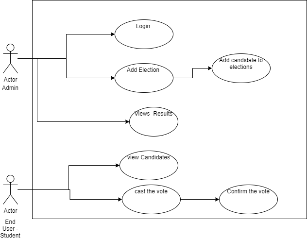
#### Sequence Diagram:
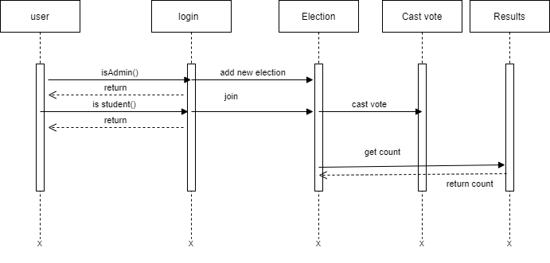
#### Flow chat:
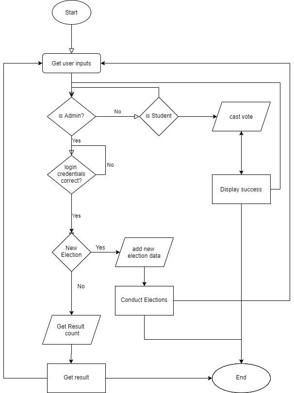

### STRUCTURAL DIAGRAM:
Structure diagrams depict the static structure of the elements in your system. i.e., how one object relates to another. It shows the things in the system – classes, objects, packages or modules, physical nodes, components, and interfaces. For example, just as the static aspects of a house encompass the existence and placement of such things as walls, doors, windows, pipes, wires, and vents.
#### Activity Diagram:
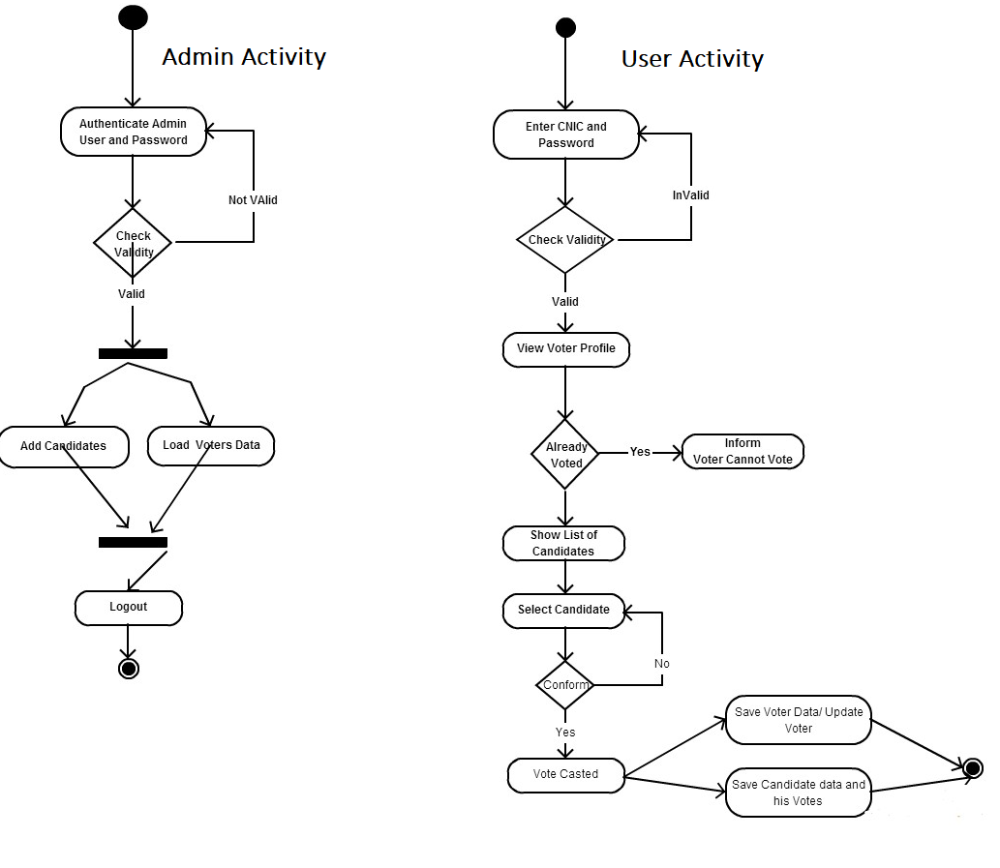

#### Class Diagram:
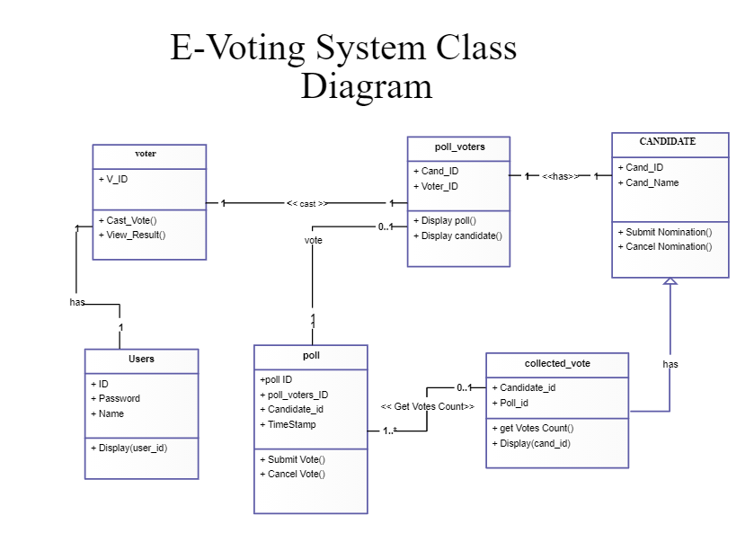

## Implementation:
### Structre:
This part for SDLC Phase helps the developer to start the implementation by looking at requirements and architecture followed by test plan.  After implementation one can use this application, below is the process of execution:
### Build And Execute:(steps)
1. First goto 3_implementation folder
2. Execute Make command on Termial
3. Navigate to Build folder
4. run votingsystem.exe/out   
   - Admin Panel:
     - UserName: Admin
     - password: admiN
     - Inititate a new election
     - provide 
       - year [2021]{YYYY format}, 
       - batch [BTCSE]{TTTTT format}, 
       - number of student taking part [55]{Any number}, 
       - and number of candinates [2]{Any number}
       - candidate name [abc,xyz]{Any candidate name}
     - Exit {Logout}
   - Student Panel:
     - Provide
       - Studentid [2021BTCSE00015]{year+Batch+5 digit rollno(prefix zeroes accordinly)}
       - cast vote by choosing the candidate id [1]{candidate id}
       - exit [0] {return}
   - Admin Panel:
     - provide username and password{ Mentioned Above}
     - get result [3] { choose from the options}
     - continue previous election [last]

## Test Plan and Outcomes:

### HIGH LEVEL TEST PLAN:
|TEST ID|TEST TYPE|TEST DESCRIPTION|TEST I/P|EXP O/P|ACTUAL O/P|TEST RESULT|
|---------|-----------|-------------------------|-----------|------------|----------|-------|
|HTS-1.1|Case based| Admin Login| USERNAME: Admin   Password: admiN| LOGGED IN SUCCESSFULLY | LOGGED IN SUCCESSFULLY |PASS|
|HTS-1.2|Case based| Admin Login| USERNAME: ABCD   Password: admin| Wrong Username or Password | Wrong Username or Password |PASS|
|HTS-1.3|Case based| Admin Login| USERNAME: Admin   Password: admin| Wrong Username or Password | Wrong Username or Password |PASS|
|HTS-1.4|Case based| Admin Login| USERNAME: 1234   Password: admin| Wrong Username or Password | Wrong Username or Password |PASS|
|HTS-2.1|Case based| Add New ELection| Year: 1900   Branch code: xyz   Max students: 55   number of Candidates:2  candaiate names: "123","456"| Wrong Year | Saving Election Info in File...  Saved Successfully : )  Creating candidate files...  Created Files successfully |FAIL|
|HTS-2.2|Case based| Add New ELection| Year: 2021   Branch code: CSE   Max students: 50   number of Candidates:0| No candiates found for the given Election | Saving Election Info in File...  Saved Successfully : )  Creating candidate files...  Created Files successfully |FAIL|
|HTS-2.3|Case based| Add New ELection| Year: 2021   Branch code: CSE   Max students: 55   number of Candidates:2  candaiate names: "QWERTY","ASDF"| Saving Election Info in File...  Saved Successfully : )  Creating candidate files...  Created Files successfully  | Saving Election Info in File...  Saved Successfully : )  Creating candidate files...  Created Files successfully |PASS|
|HTS-3.1|Case based| Student Panel| UserID: 2021BTCSE00015   your vote: 1| Thanks for your Precious Vote. | Thanks for your Precious Vote. |PASS|
|HTS-3.2|Case based| Student Panel| UserID: 2021BTCSE00016   your vote: x| invalid Input | Thanks for your Precious Vote. |FAIL|
|HTS-3.3|Case based| Student Panel| UserID: 2021BTCSE00016   your vote: 0| Ivalid Vote. Try Again | Ivalid Vote. Try Again |PASS|
|HTS-3.4|Case based| Student Panel| UserID: 2021BTCSE00|  Try Again, Enter user Id | Try Again  Enter user Id |PASS|
|HTS-3.4|Case based| Student Panel| UserID: 2021BTCSE00020   your Vote: "NONE" |Count as dummy votes: Wasted| Try Again  Enter user Id |FAIL|
|HTS-4.1|Case based| Result| Option:3| "DISPLAYS THE RESULT" | "DISPLAYS THE RESULT" |PASS|

### LOW LEVEL TEST PLAN:
|TEST ID|TEST TYPE|TEST DESCRIPTION|TEST I/P|EXP O/P|ACTUAL O/P|TEST RESULT|
|---------|-----------|-------------------------|-----------|------------|----------|-------|
|LTS-1.1|Function based| isAdmin| USERNAME: Admin   Password: admiN| BOOLEAN: 1 | BOOLEAN: 1 |PASS|
|LTS-1.2|Function based| isAdmin| USERNAME: Admin   Password: admin| BOOLEAN: 0 | BOOLEAN: 0 |PASS|
|LTS-2.1|Function based| extractyear| Student user id: 2021BTCSE00015 | INT: 2021 | INT: 2021 |PASS|
|LTS-2.2|Function based| extractyear| Student user id: 20BTCSE0000015 | INT: 0 | INT: 20 |FAIL|
|LTS-2.3|Function based| extractBranchCode| Student user id: 2021BTCSE00015 | BOOLEAN: 1 | BOOLEAN: 1 | PASS |
|LTS-2.4|Function based| extractBranchCode| Student user id: 20BTCSE0000015 | BOOLEAN: 0 | BOOLEAN: 0 | PASS |
|LTS-2.5|Function based| extractid| Student user id: 2021BTCSE00015 | INT: 15 | INT: 15 | PASS |
|LTS-2.6|Function based| extractid| Student user id: 20BTCSE0000015 | BOOLEAN: 1 | BOOLEAN: 1 | PASS |
|LTS-2.7|Function based| isValid| Student user id: 20BTCSE0000015 | BOOLEAN: 0 | BOOLEAN: 0 | PASS |
|LTS-3.1|Function based| getWinner| -- | INT: WinnerId | INT: WinnerId | PASS |
|LTS-3.2|Function based| getWinner| -- | INT: -1 | INT: -1 | PASS |
|LTS-4.1|Function based| AdminPanel | 2 | Admin panel View | Admin panel View | PASS |
|LTS-4.2|Function based| StudentPanel| 1 | Student Panel View | Student Panel View | PASS |

## Output Samples:
### images and videos
### Images:
#### Run output:
1. Admin login Image:
   - provide Admin user id and password
    
    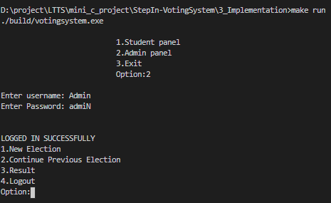

2. Admin conducting New election:
   - Provide Year, branch code, number of stdudent, number of candidates and candidate names
  
     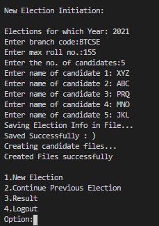

3. Generated Election txt files:
    - view file names:
  
        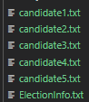

4. Student Casting votes to desired candidates:
    -  Provide Studen ID and enter candidate id:
    
        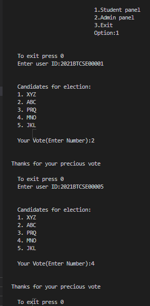
5. Viewing cadidate file data:
    - view each candidate file data:
     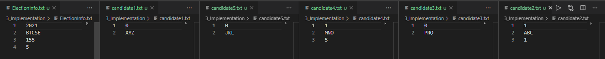

6. Admin declareing the Results:
    - View Results:
    
     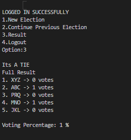

#### Test Output:
 - Test Outcomes:
     
     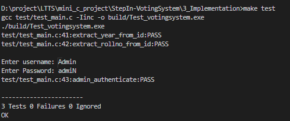

### Video:
  The video provides the sample demonstration of voting System Application. 
  The Video Below Helps in understanding the fundamentals of this application and also explains the drawback of this application. 
  The Video explain the output and ways to run the application. 
    
    

# Badges
|Badge-Code Quality Score|Badge-Code Grade|Badge-Code Quality|Badge-Valgrind|Badge-cppCheck|Badge-C/c++ CI|Badge-Unit Testing| Badge-Git Inspector |
|------------------------|----------------|------------------|--------------|---------------|--------------|-----------------|--------------|
| |  | |  |  |  | |  |